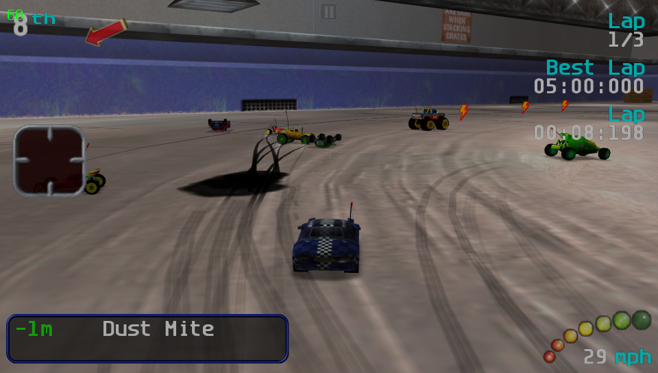

# RVGL Vita

<p align="center"></p>

This is a wrapper/port of <b>RVGL</b> for the *PS Vita*.

The port works by loading the official Android ARMv7 executables in memory, resolving its imports with native functions and patching it in order to properly run.
By doing so, it's basically as if we emulate a minimalist Android environment in which we run natively the executable as is.

## Changelog

### v1.0

- Initial release.

## Setup Instructions (For End Users)

In order to properly install the game, you'll have to follow these steps precisely:

- Install [kubridge](https://github.com/TheOfficialFloW/kubridge/releases/) and [FdFix](https://github.com/TheOfficialFloW/FdFix/releases/) by copying `kubridge.skprx` and `fd_fix.skprx` to your taiHEN plugins folder (usually `ux0:tai`) and adding two entries to your `config.txt` under `*KERNEL`:
  
```
  *KERNEL
  ux0:tai/kubridge.skprx
  ux0:tai/fd_fix.skprx
```

**Note** Don't install fd_fix.skprx if you're using rePatch plugin

- **Optional**: Install [PSVshell](https://github.com/Electry/PSVshell/releases) to overclock your device to 500Mhz.
- Install `libshacccg.suprx`, if you don't have it already, by following [this guide](https://samilops2.gitbook.io/vita-troubleshooting-guide/shader-compiler/extract-libshacccg.suprx).
- Download  [RVGL Official Full Game Package Release](https://distribute.re-volt.io/releases/rvgl_full_android_original.apk).
- Open the apk with your zip explorer and extract the files `libunistring.so` and `libmain.so` from the `lib/armeabi-v7a` folder to `ux0:data/rvgl`.
- Extract the content of the `assets` folder inside `ux0:data/rvgl`.
- Rename `ux0:data/rvgl/packs/sample.txt` to `ux0:data/rvgl/packs/default.txt`.
- Extract `datafiles.zip` available in the Release page of this repository to `ux0:data` and overwrite files if asked.
- Install the vpk and launch the game.
- Once you get prompted with virtual keyboard, press a random letter and press on the button to hide the keyboard (The arrow on left bottom with black background).
- You should have the Name section with the letter you pressed; click on the text section, it will proceed to profile selection.
- Touch the created profile.
- Using touch, navigate to Options -> Controller Settings and change Controller to PS Vita Controller.
- Touch on the background of the game (so that the game returns to the previous menu).
- Once done so, you'll be able to use physical keys.
- (Optional) It's highely suggested to adjust control bindings and sensitivity and deadzone for the analog at your preferences.

## Build Instructions (For Developers)

In order to build the loader, you'll need a [vitasdk](https://github.com/vitasdk) build fully compiled with softfp usage.  
You can find a precompiled version here: https://github.com/vitasdk/buildscripts/actions/runs/1102643776.  
Additionally, you'll need these libraries to be compiled as well with `-mfloat-abi=softfp` added to their CFLAGS:

- [SDL2_vitagl](https://github.com/Northfear/SDL/tree/vitagl)

- [libmathneon](https://github.com/Rinnegatamante/math-neon)

  - ```bash
    make install
    ```

- [vitaShaRK](https://github.com/Rinnegatamante/vitaShaRK)

  - ```bash
    make install
    ```

- [kubridge](https://github.com/TheOfficialFloW/kubridge)

  - ```bash
    mkdir build && cd build
    cmake .. && make install
    ```

- [vitaGL](https://github.com/Rinnegatamante/vitaGL)

  - ````bash
    make SOFTFP_ABI=1 HAVE_CUSTOM_HEAP=1 NO_DEBUG=1 SINGLE_THREADED_GC=1 install
    ````

After all these requirements are met, you can compile the loader with the following commands:

```bash
mkdir build && cd build
cmake .. && make
```

## Credits

- TheFloW for the original .so loader.
- CatoTheYounger for the screenshots and for testing the homebrew.
- Once13one for the Livearea assets.
- Northfear for the SDL2 fork with vitaGL as backend.
